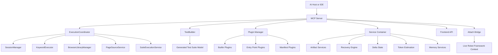
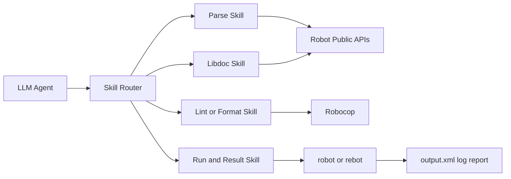
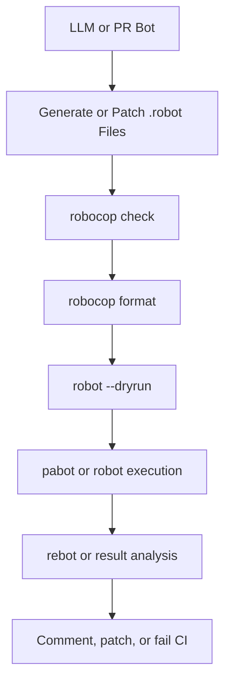
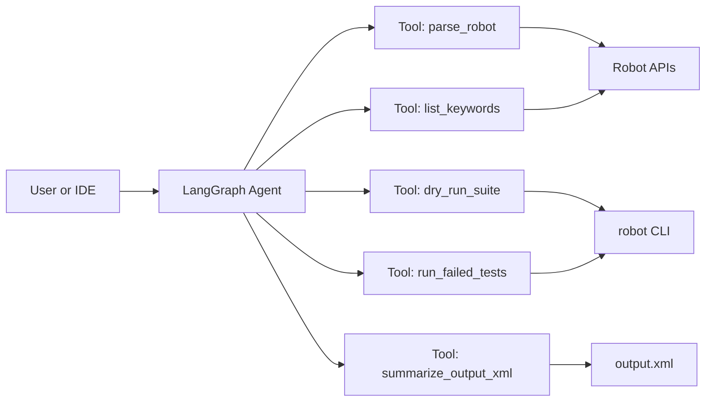
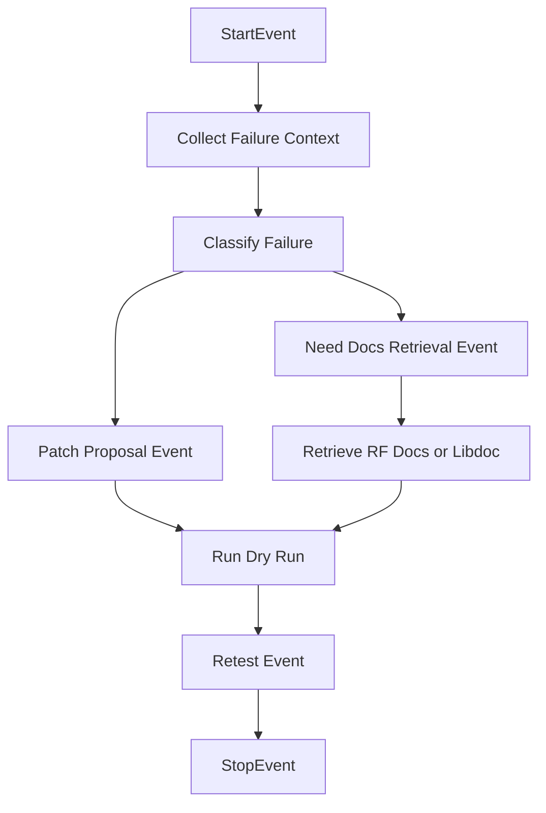
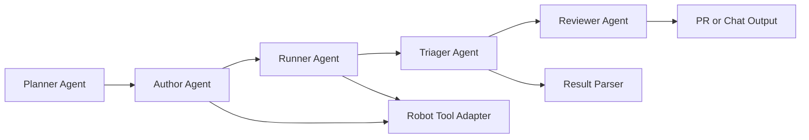
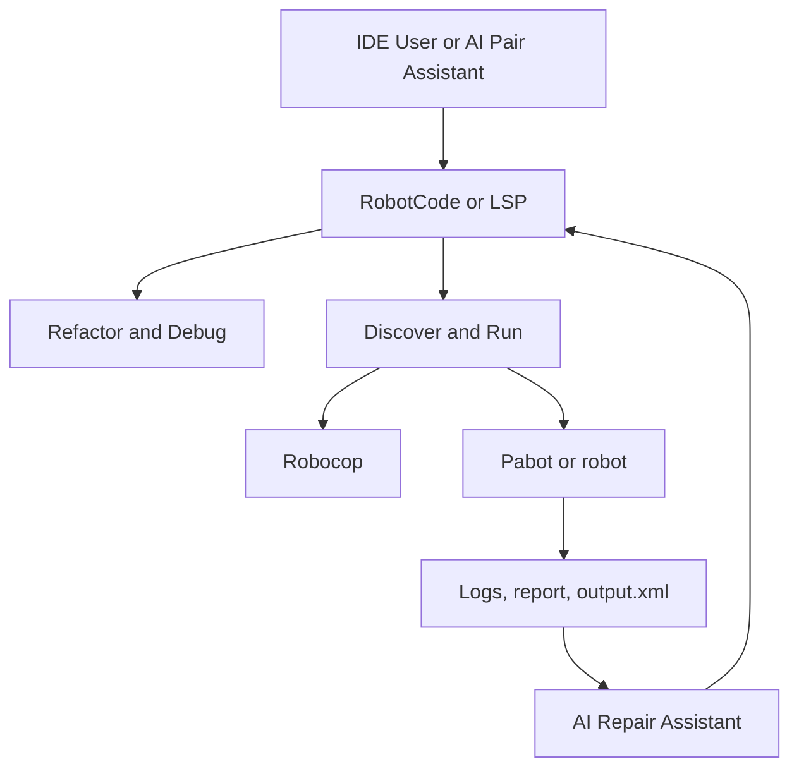
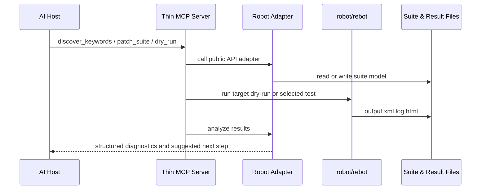
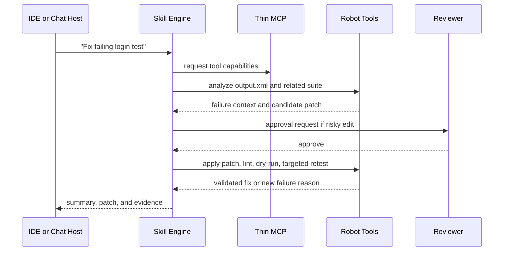
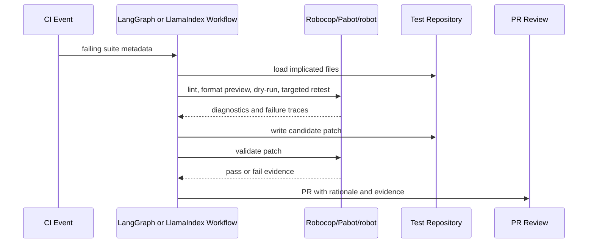

# Critical Evaluation of rf-mcp and Alternative Architectures for AI-Assisted Robot Framework Engineering

## Executive Summary

`rf-mcp` is an ambitious, feature-rich Model Context Protocol server for Robot Framework that aims to let AI agents analyze test scenarios, execute Robot keywords interactively, inspect state, import resources and custom libraries, generate test suites, and even attach to a live Robot Framework execution context. The repository shows substantial scope: a large `src/robotmcp` codebase with execution, plugin, domain, attach, and frontend packages; a broad test matrix spanning unit, integration, smoke, regression, benchmark, and end-to-end suites; and a documentation set that includes ADRs, analysis, research, reviews, and plugin authoring guidance. The project also includes optimization-oriented subsystems such as artifact externalization, delta-state responses, and persistent semantic memory. citeturn8view0turn9view0turn9view1turn9view2turn10view0turn17view0turn19view0turn24view0turn27view2

The strongest argument **for** `rf-mcp` is that it covers the full lifecycle of AI-assisted Robot Framework work in one place: scenario interpretation, keyword discovery, state capture, session-aware execution, suite generation, optional live attach, and extension through plugins. The strongest argument **against** it is that this breadth has created a very large and security-sensitive control surface, with important execution semantics depending on Robot Framework internals, a local HTTP attach bridge secured only by a shared token, and tool flows that can surface variables, page source, imported resources, and persistent memory content to an AI agent. The repository’s own ADRs document that execution internals required alignment with Robot Framework 7.3.2 semantics and that at least one large internal execution file had architectural deviations serious enough to deserve dedicated review and phased remediation. citeturn32view0turn36view1turn29view4turn29view1turn31view2turn31view4turn14view3turn19view0

My overall conclusion is that `rf-mcp` is best understood as a **powerful reference architecture and experimental integration platform**, not yet the simplest foundation for most teams. For many organizations, the best path is to **shrink the MCP core**, move agent behavior into **prepared skill libraries**, and prefer **public Robot Framework APIs and deterministic toolchains** for parsing, linting, formatting, dry runs, execution, and result analysis. If a team truly needs a stateful agent runtime, **LangGraph/LangChain** or **LlamaIndex Workflows** are generally better starting points than a monolithic MCP server, while **AutoGen** is most appropriate when genuine multi-agent collaboration is needed rather than assumed. citeturn40search1turn37search1turn39search2turn40search0turn41search1turn41search5turn41search10turn42search0turn42search4turn41search3

For practical adoption, I recommend three architecture options. The most conservative is a **simplified MCP** that keeps only core discover-run-build capabilities. The most balanced is a **thin MCP plus prepared agent skills** architecture. The cleanest long-term alternative, especially for CI-driven teams, is a **non-MCP workflow engine** built around Robot Framework public APIs, Robocop formatting/linting, parallel execution, and a traceable agent framework such as LangGraph. The remainder of this report explains why. citeturn38search10turn40search1turn45search8turn43search0turn41search10

## rf-mcp Repository Overview

The repository structure indicates an unusually broad product surface for a single package. Under `src/robotmcp`, the project is divided into `components`, `domains`, `plugins`, `frontend`, and `attach`. The `components` package contains browser, execution, variable, NLP, keyword matching, library recommendation, state management, and suite building logic. The `domains` package includes artifact output, batch execution, instruction handling, intent, keyword resolution, memory, recovery, response optimization, snapshots, timeouts, token accounting, and tool profiling. There is also a plugin system, a Django-like frontend package, and a dedicated attach bridge package for live Robot Framework control. citeturn8view0turn9view0turn9view1turn9view2turn28view0

At a high level, the architecture looks like this:



This diagram is not copied from the repository; it is a synthesis of the code and documentation. The repository itself explicitly describes a service-oriented execution design with `ExecutionCoordinator` orchestrating `SessionManager`, `KeywordExecutor`, `BrowserLibraryManager`, `PageSourceService`, and related services. The plugin manager registers plugins from built-in, entry-point, and manifest sources, and the service container lazily exposes domain services such as recovery, timeout handling, delta state, artifact storage, artifact retrieval, and token estimation. citeturn24view2turn21view1turn24view0turn23view3turn27view2turn27view4

The repository’s **center of gravity** is the execution stack. `ExecutionCoordinator` is described in code as the main orchestrator that replaced an earlier monolithic engine with a service-oriented architecture. The `execution` package exports `SessionManager`, `PageSourceService`, `KeywordExecutor`, `LocatorConverter`, and `ExecutionCoordinator`, while `TestBuilder` builds Robot Framework suites from successful execution steps and includes logic for optimization rules, evaluation namespace conversion, BDD generation, and data-driven transformations. citeturn22view0turn24view2turn21view1turn24view1turn22view6

A second major axis is **extensibility**. The plugin system centers on `LibraryPluginManager`, which registers plugin instances, metadata, capabilities, install actions, hints, prompts, state providers, type converters, keyword maps, and keyword overrides. The project also documents a `LibraryPlugin` protocol with optional lifecycle hooks, state providers, prompt bundles, type converters, and keyword override handlers, and it supports discovery via Python entry points or local manifest files. This is a real strength: it shows that the author has designed for extension instead of assuming the base package can natively know every useful Robot Framework library. citeturn22view7turn23view3turn24view0turn19view4

A third axis is **operational maturity**. The repository includes extensive test categories, a CI workflow that runs across Ubuntu, macOS, and Windows with Python 3.10–3.12, benchmark jobs, optional dependency matrix jobs, and Copilot-related end-to-end tests. There are also release notes documenting token reduction work, persistent semantic memory, and CI additions, plus ADRs and internal research/analysis artifacts. This is far more process discipline than many niche AI tooling repositories exhibit. citeturn10view0turn14view4turn14view5turn14view6turn14view7turn19view0turn18view0turn34view0turn34view1

The most important repository files and packages, from an architectural perspective, are summarized below.

| Area | Key file or package | Why it matters |
|---|---|---|
| Server entrypoint | `robotmcp.server` | This is the package entry used in installation examples and the module imported by tests using `fastmcp.Client`, making it the operational MCP boundary. citeturn32view0turn13view0 |
| Execution core | `src/robotmcp/components/execution/execution_coordinator.py` | Coordinates session management, browser libraries, keyword execution, page source, suite execution, and keyword discovery integration. citeturn24view2 |
| Test generation | `src/robotmcp/components/test_builder.py` | Builds suites, transforms to BDD style, manages data-driven mode, and contains optimization rules and expression conversion logic. citeturn24view1turn22view6 |
| Dependency injection | `src/robotmcp/container.py` | Exposes a singleton service container for pattern storage, timeouts, recovery, batch state, token estimation, delta state, artifact storage, and retrieval. citeturn27view2turn27view4 |
| Plugin system | `src/robotmcp/plugins/manager.py` and `docs/library-plugin-authoring.md` | Provides a proper plugin registry with built-in, entry-point, and manifest discovery paths plus a documented plugin contract. citeturn24view0turn23view3turn19view4 |
| Live attach bridge | `src/robotmcp/attach/mcp_attach.py` and `external_rf_client.py` | Adds a local HTTP control plane for driving keywords inside a live Robot Framework execution context. citeturn29view4turn31view2turn29view0 |
| Frontend | `src/robotmcp/frontend/*` | Shows the project is not only an MCP server but also ships a frontend surface with API, ASGI, views, URLs, config, and templates/static assets. citeturn9view2 |
| Test estate | `tests/*` and `.github/workflows/ci.yml` | Indicates serious investment in unit, integration, regression, benchmark, and E2E validation across environments and extras. citeturn10view0turn14view4turn14view6turn14view7 |
| Architecture control | `docs/adr/ADR-020-namespace-execution-architecture-alignment.md` | Documents a critical review of execution internals versus Robot Framework 7.3.2 native lifecycle behavior. citeturn36view1 |

The dependency picture is broad rather than narrow. The package requires Python 3.10+, uses `robotmcp.server` as its runtime entry, and is designed to work with optional Robot Framework ecosystems such as Browser Library, SeleniumLibrary, RequestsLibrary, AppiumLibrary, and memory-related extras. Tests directly use `fastmcp.Client`, CI initializes Browser Library and Playwright, and release notes document semantic memory powered by `sqlite-vec` and `model2vec`. That combination tells you immediately that `rf-mcp` is not just “an MCP adapter”; it is a multi-library orchestration layer with optional browser, API, mobile, memory, and frontend concerns. citeturn32view0turn13view0turn11view0turn19view0

## Critical Evaluation

### Strengths

The repository’s biggest strength is **end-to-end workflow coverage**. From the user-facing documentation alone, the project can analyze scenarios, execute steps, discover keywords, capture application state and page source, build suites, run dry runs, run full suites, recommend libraries, import resources and custom libraries, inspect session context, and provide locator guidance. In practice, that means it tries to help not only with *test generation*, but also with *refactoring, debugging, and repair*. Many alternatives choose one of those problems; `rf-mcp` tries to solve all of them with one control plane. citeturn32view0

A second strength is **architectural extensibility**. The plugin model is not an afterthought. The project defines a plugin contract, lifecycle hooks, prompt bundles, state providers, install actions, keyword maps, type converters, and discovery through entry points and manifests. This is exactly the right instinct for a Robot Framework AI integration, because real-world test estates differ sharply by library mix, domain conventions, and internal helper keywords. A plugin-ready architecture is much more defensible than hard-coding everything into the core server. citeturn19view4turn24view0turn23view3

A third strength is **tooling maturity and internal documentation discipline**. The repo contains ADRs, analysis docs, research notes, release notes, benchmarks, frontend code, and broad test categories. CI covers three operating systems, multiple Python versions, optional dependency matrices, and benchmark execution. That is strong evidence that the codebase is being actively shaped and measured, rather than merely demoed. citeturn10view0turn14view4turn14view6turn14view7turn17view0turn18view0turn34view0turn34view1

Finally, `rf-mcp` has clear innovation in **response and token optimization**. The release notes document artifact externalization, a `fetch_artifact` tool, slim tool profiles, delta state retrieval, automatic profile selection, and reported token savings of 71–88% across tools. The service container also exposes dedicated artifact and delta-state services, which suggests these optimizations are first-class concerns, not merely postprocessing hacks. For agent systems, that matters because the practical failure mode is often context bloat rather than missing features. citeturn19view0turn27view2

### Weaknesses and Architectural Fault Lines

The clearest weakness is **too much responsibility in one package**. `rf-mcp` is simultaneously an MCP server, a Robot execution engine, a state tracker, a suite builder, a plugin host, an attach bridge, a semantic memory system, an artifact manager, a response optimizer, and a frontend application. That breadth raises not only code size but also conceptual load. For an AI agent, the large tool surface means more decisions to make and more ways to pick a suboptimal tool. For maintainers, it means more coupling between distinct concerns that could have been isolated behind narrower interfaces. citeturn9view0turn9view1turn9view2turn17view0turn32view0

The second weakness is **execution fragility caused by deep integration with Robot Framework internals**. The most important evidence here is the repository’s own ADR-020. It records that an external code review against Robot Framework 7.3.2 internals found five issues in execution lifecycle handling, including a bug involving double `start_test` / `end_test`, lifecycle ordering deviations, direct method bypass, double assignment, and double execution path concerns. The ADR explicitly warns that the APIs involved are private and may change across Robot Framework versions. That is not a minor concern: it means the most powerful part of the system is also the part most exposed to version drift. citeturn36view1

The third weakness is **size concentration in hot files**. ADR-020 notes that one file, `rf_native_context_manager.py`, was around 1,200 lines and the focus of the execution review. Even without line counting every module in the repository, the presence of large coordinator-style files, a large suite builder, and a large attach implementation suggests the design still contains some “god object” tendencies even after service extraction. This does not make the project unmaintainable, but it does mean maintainability depends heavily on the discipline visible in ADRs and tests continuing over time. citeturn36view0turn24view1turn31view2

### Security and Privacy Concerns

The strongest repo-specific security concern is the **attach bridge**. The `McpAttach` library starts a local `HTTPServer`, authenticates requests by comparing the `X-MCP-Token` header, and defaults to host `127.0.0.1`, port `7317`, and token `"change-me"`. The matching `ExternalRFClient` likewise defaults to host `127.0.0.1`, port `7317`, and token `"change-me"`, uses plain `http.client.HTTPConnection`, and sends the token in a header. This is acceptable only as a **local developer convenience**. It is not a strong remote security model, and any team using attach mode needs to treat it as localhost-only infrastructure with explicit token rotation and process isolation. citeturn31view2turn31view4turn31view5turn29view0turn29view1

A second concern is the **breadth of privileged actions exposed to the agent**. The documented tool surface includes importing resource files, importing custom Python libraries, listing available keywords, diagnosing session context, getting page source, getting session state, and executing keywords. Tests also show session-state retrieval including `variables`, `page_source`, and `dom_stream`, while release notes show persistent memory capabilities for recalling steps, fixes, and locators. That means an AI agent can potentially read, store, or propagate sensitive information embedded in variables, HTML, DOM snapshots, locators, and remediation notes. This is an inference from the exposed data types, but it is a high-confidence one: test automation environments often carry credentials, tokens, internal URLs, and personal data. citeturn32view0turn14view3turn19view0

A third concern is **tool and protocol trust boundaries**. MCP itself standardizes a host-client-server model with tools, resources, prompts, and optional features such as sampling; the latest spec also frames authorization specifically for HTTP-based transports. `rf-mcp` mostly uses local stdio for normal MCP operation, but its attach bridge is a separate local HTTP control surface outside standard Streamable HTTP MCP transport. That makes the effective trust model hybrid and application-defined. More broadly, recent security research has argued that MCP ecosystems remain vulnerable to prompt injection, capability over-claiming, and trust propagation issues unless deployments add explicit controls. That broader criticism is not unique to `rf-mcp`, but it raises the bar for any tool-rich MCP server that can execute code-adjacent actions. citeturn38search1turn38search9turn38search10turn37academia54turn37academia56

The repository’s CI and workflow setup is solid, but the visible workflows focus on build/test, Docker publishing, benchmarks, and E2E runs. I did not find a dedicated security-scanning workflow among the listed workflow files. The absence of visible CodeQL/Bandit-like automation in the workflow list is not proof of weak security, but it does suggest that supply-chain and static security scanning are not as prominent as functional validation in the current automation posture. citeturn10view1turn11view0turn11view1

### Maintainability, Testability, Performance, and Developer UX

**Maintainability** is mixed. On the positive side, the project shows strong engineering hygiene through ADRs, release notes, plugin docs, benchmark suites, and a service container that separates several domain concerns. On the negative side, the execution core still leans on private Robot Framework behavior, and the architecture keeps accumulating domains under one package instead of turning them into thinner independently testable services or companion packages. citeturn17view0turn18view0turn24view0turn27view4turn36view1

**Testability** is stronger than average for this category. The repository has `unit`, `integration`, `smoke`, `regression`, `frontend`, `fastmcp`, `benchmarks`, and `e2e` tests, and CI runs coverage, benchmark jobs, optional-extras matrices, and several Copilot-oriented E2E suites. At the same time, CI sets `OPENAI_API_KEY`, `RUN_NETWORK_TESTS`, Playwright/browser setup, and optional Copilot CLI credentials. That means at least part of the validation story depends on networked external systems and model APIs, which is useful for realism but less ideal for hermetic reproducibility. citeturn10view0turn11view0turn14view6turn14view7

**Performance** is again mixed. The repo contains dedicated benchmark suites for latency, memory, token reduction, learning performance, namespace lifecycle, and more, and the release notes document meaningful token-saving work. That is a real strength. But the overall agent loop is still likely to be expensive in both latency and token terms when interactive execution requires many tool invocations, especially when attach mode or large DOM/state payloads are involved. The attach client’s own design shows short socket reachability probes plus separate HTTP requests per operation, which is fine for debugging but not necessarily ideal for high-throughput CI fixing loops. citeturn33view0turn19view0turn29view0

**Developer UX** depends heavily on audience. For advanced users who want an AI-native Robot Framework “control tower,” the project is unusually capable. For most engineers and for most language models, the UX risk is that the tool space is too large and too nuanced. A model that must choose among scenario analysis, session import, context diagnosis, state fetch, page source, session validation, keyword discovery, execution, build, dry run, memory recall, artifact fetch, and attach-mode actions can easily waste turns or create brittle workflows. The plugin system helps, but it does not remove the cognition cost of an all-in-one design. citeturn32view0turn24view0turn19view4

## Alternative Approaches

The key strategic question is not “what replaces `rf-mcp`,” but rather “what **smaller, safer, more controllable** architecture still accelerates test generation, refactoring, debugging, and fixing?” The alternatives below focus on public Robot Framework APIs, official or primary framework docs, and widely used agent runtimes. Robot Framework itself already offers listeners, parsers, pre-run modifiers, result APIs, and standard tools such as Libdoc; those are powerful primitives for building AI-assisted workflows without reproducing the full complexity of a live internal execution context. citeturn37search1turn39search2turn40search0turn40search1

### Prepared Agent Skills Framework

This alternative treats “skills” as curated, versioned, deterministic wrappers over public Robot Framework capabilities: parse suite, build libdoc cache, lint, format, dry-run, execute selected tests, read output XML, summarize failures, propose patch, and validate again. The point is to move intelligence into a **prepared skill layer** that gives the model a small number of reliable building blocks instead of a huge server-wide tool catalog. The official Robot Framework APIs and extension points are well suited to this because they support listeners, parser interfaces, pre-run modifiers, and programmatic API access for tooling and model manipulation. citeturn37search1turn39search2turn40search0turn40search1



| Aspect | Detail |
|---|---|
| Description | Curated skill library over Robot Framework public APIs and CLI, with small structured inputs and outputs. |
| Pros | Lowest prompt burden for the agent; easy to test each skill; easier to harden; avoids deep dependence on private execution internals. |
| Cons | Less “live” than attach-style interactive execution; may require more filesystem and process orchestration. |
| Implementation effort | **Medium** |
| Required components | Robot Framework public APIs, Libdoc, listeners or pre-run modifiers where useful, Robocop, optional Pabot, a small skill registry, and result parsers. citeturn37search1turn40search0turn40search1turn45search8turn43search0 |
| Example workflow | The agent selects `inspect_failure_context`, receives failed keyword stack and nearby source, calls `propose_patch`, then calls `lint_and_dry_run`, and only then opens a PR or patch suggestion. |
| Recommended tools and libraries | Robot Framework public API, Libdoc, Robocop 6+, Pabot, simple Python skill registries. citeturn37search1turn40search1turn45search8turn43search0 |

This is the approach I would recommend for teams that prioritize **predictability, reviewability, and secure CI integration** over agentic spontaneity.

### Script-Based Pipeline

A script-based pipeline is the most conservative architecture. The AI does not drive a broad runtime directly; instead, it produces or edits Robot code, and deterministic scripts do the rest: lint, format, dry-run, parallel execution, output parsing, patch generation, and report surfacing. Modern Robot Framework tooling already supports much of this flow. Robocop 6 performs static analysis and formatting of Robot Framework code, and Pabot provides parallel test execution. Pre-run modifiers can also inject focused test-reduction or repair-oriented transformations before execution when needed. citeturn45search8turn43search0turn40search0



| Aspect | Detail |
|---|---|
| Description | Deterministic CLI-first workflow driven by scripts or tasks rather than an interactive agent server. |
| Pros | Simplest security model; cheapest to operate; excellent CI fit; no MCP dependency; best auditability. |
| Cons | Less interactive for exploratory debugging; weaker support for conversational step-by-step execution. |
| Implementation effort | **Low to Medium** |
| Required components | Python scripts or task runner, Robocop, Robot CLI, Rebot/result parsing, optional Pabot, optional PR comments or issue bot. citeturn45search8turn43search0turn37search1 |
| Example workflow | A failing CI run triggers a repair script that extracts the failed test, runs lint/format, executes a dry run, then re-runs the affected shard with Pabot and posts diagnostics. |
| Recommended tools and libraries | Robocop 6+, Pabot, Robot Framework CLI, lightweight result analysis scripts. citeturn45search8turn43search0 |

This is the strongest option when the goal is to **accelerate fixing and refactoring in CI** without introducing a powerful long-lived agent runtime.

### LangChain and LangGraph Tool Integration

LangChain offers a production-ready `createAgent()` abstraction, and its agent runtime is graph-based via LangGraph. LangGraph is explicitly positioned as a low-level orchestration framework for long-running, stateful agents, while LangSmith and Agent Server capabilities add tracing, human-in-the-loop review, time travel, streaming, and even MCP endpoints if teams still want MCP compatibility later. From a design perspective, this makes LangGraph a strong candidate for building **traceable AI workflows** around a small Robot toolset instead of embedding all orchestration inside an MCP server. citeturn41search1turn41search5turn41search8turn41search10turn41search12



| Aspect | Detail |
|---|---|
| Description | Use LangChain tools with LangGraph for deterministic state machine control over AI-assisted Robot workflows. |
| Pros | Strong observability; explicit orchestration; human approval points; easier to reason about than opaque multi-tool MCP chatter. |
| Cons | Another framework layer to own; requires deliberate schema design for tools; still needs a Robot adapter. |
| Implementation effort | **Medium** |
| Required components | LangChain tool wrappers, LangGraph workflow, Robot adapters, tracing, optional deployment/runtime service. citeturn41search1turn41search5turn41search10turn41search12 |
| Example workflow | The graph begins with `analyze_failure`, branches to `format_or_patch`, gates on a human-approval node, then runs `dry_run` and `targeted_retest` before finalizing. |
| Recommended tools and libraries | LangGraph, LangChain tools, LangSmith tracing, Robot API adapters. citeturn41search1turn41search8turn41search10 |

For most teams that truly want agentic behavior, this is the **best default framework choice**.

### LlamaIndex Workflows with Robot Adapters

LlamaIndex Workflows provide an event-driven step model in which steps emit events that trigger later steps, and the framework is instrumented for observability. LlamaIndex also distinguishes between prebuilt agent workflows and fully custom event-driven workflows, with tools as first-class abstractions. That makes it a natural fit for **repair pipelines, review loops, and retrieval-augmented failure analysis**, especially when teams want strong control over branching logic without committing to a full MCP-first design. citeturn42search0turn42search1turn42search2turn42search4turn42search6



| Aspect | Detail |
|---|---|
| Description | Event-driven LlamaIndex workflow with Robot-specific steps and optional retrieval over docs, Libdoc, and internal conventions. |
| Pros | Clean step/event semantics; good for RAG-heavy debugging; naturally supports reflection loops and parallel branches. |
| Cons | Slightly more natural for document-centric flows than for very IDE-centric live execution; still requires a Robot adapter layer. |
| Implementation effort | **Medium** |
| Required components | LlamaIndex workflows, tools, optional retrievers/vector store, Robot adapters, result parsers. citeturn42search0turn42search3turn42search4turn42search6 |
| Example workflow | A failed test triggers documentation retrieval for the implicated library, generates a patch proposal, then runs dry-run and selected retests before stopping. |
| Recommended tools and libraries | `llama_index.core.workflow`, FunctionAgent or AgentWorkflow if needed, Tool abstractions, Libdoc index. citeturn42search0turn42search2turn42search5turn42search6 |

This is especially attractive when **retrieval and event-driven repair** matter more than direct IDE tool chatter.

### AutoGen Multi-Agent System

AutoGen now presents a layered offering: AgentChat for prototyping, Core for scalable event-driven multi-agent systems, Studio for visual prototyping, and extensions including `McpWorkbench` for MCP servers and code execution tools. That means AutoGen is a legitimate option when the workflow truly benefits from distinct agents such as **planner, test author, runner, triager, and reviewer**. The advantage is role separation; the danger is unnecessary complexity and higher latency if multi-agent collaboration is used for work that a single well-instrumented workflow could handle. citeturn41search3turn41search7



| Aspect | Detail |
|---|---|
| Description | Role-specialized agents cooperate through AutoGen AgentChat or Core, all using shared Robot adapters. |
| Pros | Useful when task decomposition is genuinely complex; good for research-y or enterprise coordination scenarios; MCP interoperability exists through `McpWorkbench`. |
| Cons | Highest orchestration overhead; greater debugging burden; often overkill for routine Robot repairs or generation. |
| Implementation effort | **High** |
| Required components | AutoGen AgentChat or Core, model client, tool adapters, result storage, review policies, optional Studio. citeturn41search3turn41search7 |
| Example workflow | A planner selects a subset of failing suites, an author proposes edits, a runner executes them, a triager explains failures, and a reviewer approves or rejects patches. |
| Recommended tools and libraries | `autogen-agentchat`, `autogen_core`, `autogen_ext`, Robot tool wrappers, explicit approval policies. citeturn41search3turn41search7 |

My advice is to use AutoGen only when the team can clearly justify **multiple specialized agents**.

### Specialized Robot Framework Adapter with IDE and CI Tooling

This alternative is less about “agent framework” and more about **maximizing leverage from the Robot Framework ecosystem itself**. RobotCode now provides a language server, debugger, analyzer, REPL, test discovery, CLI, `robot.toml`, refactoring features, and Robocop integration. The older `robotframework-lsp` project still exists as a language-server monorepo with VS Code and IntelliJ support. On the quality side, Robocop now covers static analysis and formatting, while standalone Robotidy is deprecated and folded into newer Robocop workflows. In CI, Pabot adds high-value parallelism. citeturn43search1turn43search2turn43search5turn44search0turn45search0turn45search8turn43search0



| Aspect | Detail |
|---|---|
| Description | Keep the control plane primarily in IDE and CI tooling, and let AI operate through editor actions, scripts, and result analysis. |
| Pros | Excellent developer ergonomics; strong refactoring and debugging support; minimal custom backend code; easier adoption in existing teams. |
| Cons | Less portable than pure server-based designs; may depend on specific IDE workflows; weaker as a standalone conversational backend. |
| Implementation effort | **Low to Medium** |
| Required components | RobotCode or LSP, Robocop 6+, Pabot, Robot CLI, optional editor extension or local assistant integration. citeturn43search1turn43search2turn44search0turn45search8turn43search0 |
| Example workflow | The AI suggests a rename or keyword extraction inside the IDE, RobotCode updates references, Robocop checks style, and Pabot re-runs the affected slices in CI. |
| Recommended tools and libraries | RobotCode, Robocop, Pabot, Robot Framework CLI, optional `robotframework-lsp` compatibility. citeturn43search1turn43search2turn44search0turn45search8turn43search0 |

For many teams, this is the **highest-value, lowest-risk acceleration path** for authoring, refactoring, and debugging.

## Comparative Assessment

The table below compares `rf-mcp` with the alternative architecture families. The ratings are my synthesis based on repository code, official documentation, and the security/maintainability trade-offs discussed above.

| Approach | Capabilities | Complexity | Extensibility | Security posture | Cost | Latency | Developer ergonomics |
|---|---|---:|---:|---:|---:|---:|---:|
| `rf-mcp` as-is | Very high for end-to-end interactive generation, execution, attach, memory, and suite building | High | High | Medium to Low unless carefully sandboxed | Medium to High | Medium to High | Medium for experts, lower for general teams |
| Prepared agent skills | High for generation, repair, refactor, and debugging loops | Medium | High | High | Low to Medium | Medium | High |
| Script-based pipeline | Medium to High for fixing, validation, and CI automation | Low | Medium | High | Low | Low | High in CI, Medium in chat UX |
| LangChain/LangGraph | High with strong orchestration and observability | Medium | Very high | Medium to High depending on tools exposed | Medium | Medium | High for platform teams |
| LlamaIndex workflows | High for event-driven and RAG-heavy workflows | Medium | High | Medium to High | Medium | Medium | Medium to High |
| AutoGen multi-agent | Potentially very high, but only if multi-agent work is real | High | Very high | Medium | High | High | Medium |
| Robot adapter plus IDE and CI tooling | High for authoring, refactoring, local debugging, and CI validation | Low to Medium | Medium | High | Low | Low | Very high |

The key takeaway is that `rf-mcp` wins on **native breadth**, but loses ground on **simplicity, hardening, and predictable operations**. Script-based pipelines and prepared-skill architectures score better on safety and maintainability because they keep the agent’s power focused on well-scoped actions. LangGraph and LlamaIndex score well when teams want richer agent behavior but still want structured control. AutoGen only becomes the right choice when different agents truly need distinct incentives or responsibilities. RobotCode and the broader Robot tooling ecosystem provide the best baseline ergonomics regardless of which architecture sits on top. citeturn32view0turn36view1turn41search10turn42search0turn41search3turn43search1turn45search8turn43search0

## Recommended Designs

### Simplified MCP Focused on Core Capabilities

This design keeps MCP because it is useful for IDE integration and standardized tool calling, but it removes most of the high-risk and high-coupling features from the core. The server should expose only a **small canonical tool set**: keyword discovery, Libdoc-backed documentation lookup, suite parsing and patching, dry run, selected execution, output analysis, and suite generation from structured steps. Attach mode, persistent semantic memory, frontend, and broad session internals should become optional plugins or separate companion services. This recommendation follows directly from the repo’s own evidence that execution internals and broad server scope are the main maintainability and risk hotspots. citeturn36view1turn24view0turn27view4

| Component | Purpose |
|---|---|
| Thin MCP server | Standard interface to AI hosts and IDEs. citeturn38search10turn38search11 |
| Robot public API adapter | Parse suites, enumerate tests, apply safe edits. citeturn40search1turn39search2 |
| Libdoc cache service | Keyword docs, arguments, and library metadata. citeturn37search1 |
| Execution wrapper | Dry run and targeted execution through Robot CLI. citeturn37search1turn43search0 |
| Result analyzer | Summarize failures from output files. citeturn37search1turn40search1 |
| Optional plugins | Browser aids, memory, or attach moved out of the core. citeturn19view4turn23view3 |



**Minimal viable feature set:** keyword listing, Libdoc lookup, parse/patch suite, `robocop check`, dry run, selected execution, output XML summarization, and optional suite generation from a structured plan. citeturn37search1turn45search8turn40search1

**Migration path from `rf-mcp`:** keep existing user-facing tool names where possible, but re-implement them as thin wrappers over public APIs and CLI. Defer or deprecate attach mode, semantic memory, broad session-state access, and frontend hosting into separate packages. Preserve the plugin contract for add-ons, but make the default install intentionally small. citeturn24view0turn19view4turn23view3turn36view1

**Estimated effort and risks:** **Medium** effort. The main risk is loss of some “magic” interactive behavior that current users may like, especially around live execution context. The payoff is a far smaller trusted computing base and better version resilience.

### MCP Plus Prepared Agent Skills Framework

This is the design I would recommend for most teams that still want an MCP integration. The MCP server becomes a **thin transport and capability layer**, while agent reasoning lives in a separate skills package that defines workflows such as “generate a test from a story,” “refactor a suite safely,” “triage a failure,” and “repair and validate a selector.” Each skill composes a handful of reliable tools with guardrails, instead of letting the model freely roam a large tool catalog. This aligns well with the official MCP model of exposing tools/resources/prompts while keeping application-specific orchestration outside the protocol boundary. citeturn38search9turn38search10turn38search8turn40search1

| Component | Purpose |
|---|---|
| Thin MCP server | Exposes only small, typed tools and reference resources. citeturn38search9turn38search10 |
| Skill registry | Curated skills for generation, refactor, debug, and fix. |
| Prompt and policy bundle | Task-specific guidance, approvals, and scope limits. |
| Robot adapter tools | Parse, lint, format, dry-run, execute, analyze. citeturn40search1turn45search8turn43search0 |
| Optional retrieval layer | Query Libdoc, internal conventions, or failed test history. citeturn37search1turn42search4 |
| Trace store | Keep structured run traces for debugging the assistant itself. citeturn41search8turn41search10 |



**Minimal viable feature set:** four prepared skills — `generate_test_from_story`, `refactor_suite_safely`, `triage_failure`, and `repair_and_validate`. Each should have explicit input/output schemas and its own fallback behavior.

**Migration path from `rf-mcp`:** migrate current instruction templates, plugin hints, and tool guidance into the skill layer; keep the MCP-facing tools narrow; move optimization domains such as artifact externalization and delta responses into reusable libraries; treat attach mode as an optional expert-only skill. citeturn17view0turn19view4turn19view0

**Estimated effort and risks:** **Medium to High** effort. The largest risk is split-brain complexity if server tools and skill logic evolve independently. The benefit is much better agent reliability and lower prompt entropy.

### Alternative Implementation Without MCP as the Core Abstraction

This design drops MCP from the center and uses a workflow engine such as LangGraph or LlamaIndex Workflows as the primary orchestration layer. MCP can still be added later as a thin exposure layer if needed, but the architecture is fundamentally a **workflow system around Robot Framework public APIs and CI tooling**, not a tool-rich MCP server. For organizations focused on PR automation, CI repair, and observable agent behavior, this is often the cleanest long-term answer. citeturn41search10turn41search12turn42search0turn42search4turn40search1

| Component | Purpose |
|---|---|
| Workflow runtime | Deterministic agent orchestration and branching logic. citeturn41search10turn42search0 |
| Robot adapter package | Parse, patch, dry-run, execute, summarize results. citeturn40search1turn37search1 |
| Quality toolchain | Robocop check and format; optional Pabot for speed. citeturn45search8turn43search0 |
| Retrieval or docs index | Libdoc and internal guidance retrieval when needed. citeturn37search1turn42search4 |
| Review and approval node | Human-in-the-loop for risky file edits. citeturn41search8 |
| CI integration | GitHub Actions or equivalent for event-driven repair loops. citeturn11view0 |



**Minimal viable feature set:** failure triage, patch proposal, lint/format, dry run, targeted retest, PR generation, and traceable execution history.

**Migration path from `rf-mcp`:** extract reusable logic from `TestBuilder`, selected keyword discovery utilities, and result summarization into plain Python packages; stop registering most of them as MCP tools; preserve MCP only where an IDE or host actually needs it. citeturn24view1turn24view2turn32view0

**Estimated effort and risks:** **High** effort if started from scratch, but strategically cleanest. The main risk is losing immediate compatibility with existing MCP-centric host workflows.

## Illustrative Integration Patterns

The following snippets are illustrative rather than drop-in production code. They are intentionally biased toward **public Robot Framework APIs and deterministic execution** because those surfaces are easier to test and harden than private execution internals or broad attach-mode interactions. Robot Framework officially supports listener interfaces, parser interfaces, pre-run modifiers, and programmatic APIs for exactly these kinds of integrations. citeturn37search1turn39search2turn40search0turn40search1

### Example Prepared Skill

```python
from dataclasses import dataclass
from pathlib import Path
import subprocess
import json

@dataclass
class SkillResult:
    ok: bool
    summary: str
    artifacts: dict

def triage_failure_and_validate(test_path: str) -> SkillResult:
    """Prepared skill: lint, dry-run, and collect deterministic evidence."""
    path = Path(test_path)

    lint = subprocess.run(
        ["robocop", "check", str(path)],
        capture_output=True,
        text=True,
    )

    dry = subprocess.run(
        ["robot", "--dryrun", str(path)],
        capture_output=True,
        text=True,
    )

    summary = {
        "lint_rc": lint.returncode,
        "dryrun_rc": dry.returncode,
        "lint_tail": lint.stdout[-2000:],
        "dryrun_tail": dry.stdout[-2000:] + dry.stderr[-2000:],
    }

    ok = lint.returncode == 0 and dry.returncode == 0
    return SkillResult(
        ok=ok,
        summary="Dry run and lint check completed.",
        artifacts=summary,
    )
```

This pattern works well because the agent receives a **single structured result** instead of having to coordinate many low-level tools.

### Example Script-Based Repair Pipeline

```python
import subprocess
from pathlib import Path

def repair_pipeline(target: str) -> int:
    commands = [
        ["robocop", "format", target],
        ["robocop", "check", target],
        ["robot", "--dryrun", target],
        ["pabot", "--testlevelsplit", "--processes", "4", target],
    ]

    for cmd in commands:
        proc = subprocess.run(cmd, text=True)
        if proc.returncode != 0:
            return proc.returncode
    return 0

if __name__ == "__main__":
    raise SystemExit(repair_pipeline("tests/login.robot"))
```

This is intentionally boring. That is the point. In many CI environments, “boring and deterministic” beats “conversational but difficult to reason about.”

### Example LangChain Tool Wrapper

```python
from langchain.tools import tool
import subprocess

@tool
def robot_dry_run(path: str) -> str:
    """Run Robot Framework dry run and return concise diagnostics."""
    proc = subprocess.run(
        ["robot", "--dryrun", path],
        capture_output=True,
        text=True,
    )
    output = (proc.stdout + "\n" + proc.stderr).strip()
    return output[-4000:]
```

A real implementation would add explicit schemas, timeout handling, artifact paths, and postprocessing, but the principle is simple: expose **narrow tools** with deterministic behavior and concise return values. LangChain’s recommended tool-oriented agent patterns and LangGraph’s stateful orchestration work especially well with this approach. citeturn41search5turn41search10turn41search12

### Example Robot Framework Listener Hook

```python
from robot.api import logger

class FailureCollector:
    ROBOT_LISTENER_API_VERSION = 3

    def __init__(self):
        self.failures = []

    def end_keyword(self, data, result):
        if result.failed:
            self.failures.append(
                {
                    "keyword": result.name,
                    "status": result.status,
                    "message": result.message,
                    "source": getattr(data, "source", None),
                    "lineno": getattr(data, "lineno", None),
                }
            )
            logger.info(f"Captured failure in keyword: {result.name}")
```

Listener version 3 is officially recommended and is a highly effective place to collect structured failure context for AI-assisted fixing without needing a live attach bridge. citeturn37search1

### Example CI Integration Hook

```yaml
name: Robot Repair Validation

on:
  pull_request:
  workflow_dispatch:

jobs:
  validate-robot:
    runs-on: ubuntu-latest
    steps:
      - uses: actions/checkout@v4
      - uses: actions/setup-python@v5
        with:
          python-version: "3.12"
      - run: pip install robotframework robotframework-robocop robotframework-pabot
      - run: robocop check tests
      - run: robocop format --check tests
      - run: robot --dryrun tests
      - run: pabot --testlevelsplit --processes 4 tests
```

This design keeps the AI’s role in proposing changes while letting CI perform the risky parts through deterministic tools.

## Open Questions and Limitations

This report is comprehensive in architecture and design intent, but not exhaustive in file-by-file source review. I inspected representative repository code, repository structure, ADRs, release notes, tests, and workflows, but not every implementation file. In particular, the dependency overview is intentionally high-level rather than a full lockfile-style inventory. citeturn8view0turn9view0turn10view0turn17view0turn36view1

I also did not execute the repository, benchmark its runtime behavior, or perform independent security testing. Performance statements therefore rely on the included benchmark suite inventory, repository release notes, and code structure rather than reproduced measurements. Similarly, security conclusions are based on exposed capability surfaces, documented transport behavior, attach-bridge implementation details, and relevant primary documentation and research—not on a penetration test. citeturn33view0turn19view0turn31view2turn29view0turn38search1turn37academia54

Within those limits, the central conclusion remains robust: **`rf-mcp` is impressive and unusually capable, but it should be narrowed, modularized, or used as a source of reusable components rather than adopted wholesale unless a team truly needs its full interactive breadth.** For most organizations, a thin MCP or non-MCP orchestration layer over public Robot Framework APIs and focused tools will deliver better security, maintainability, and agent reliability. citeturn36view1turn40search1turn41search10turn42search0